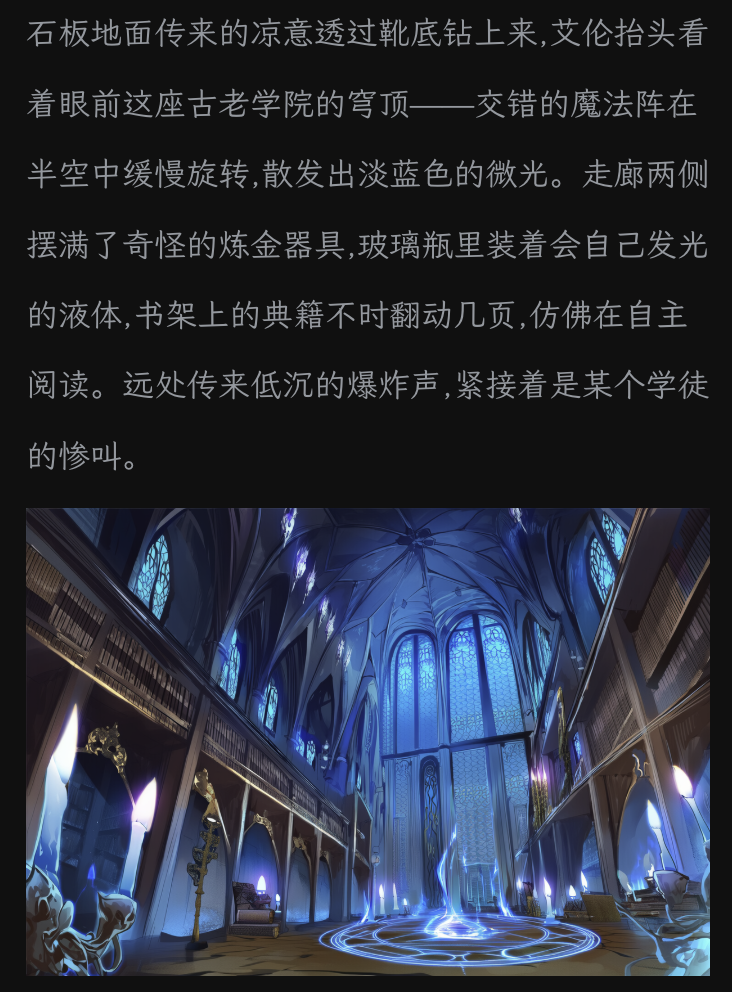
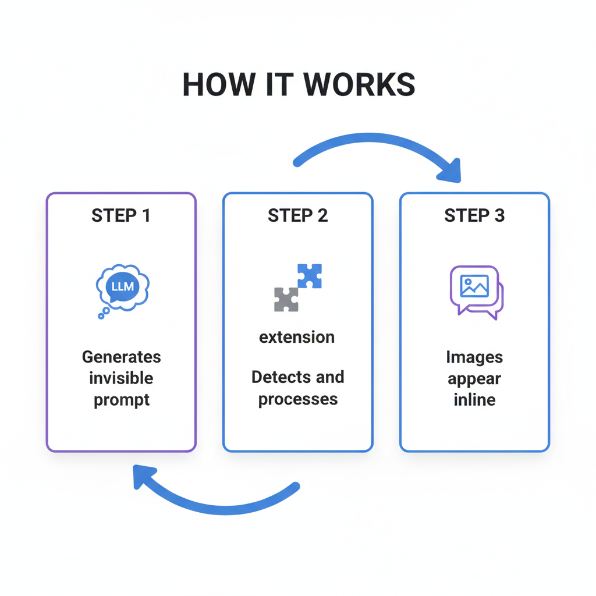
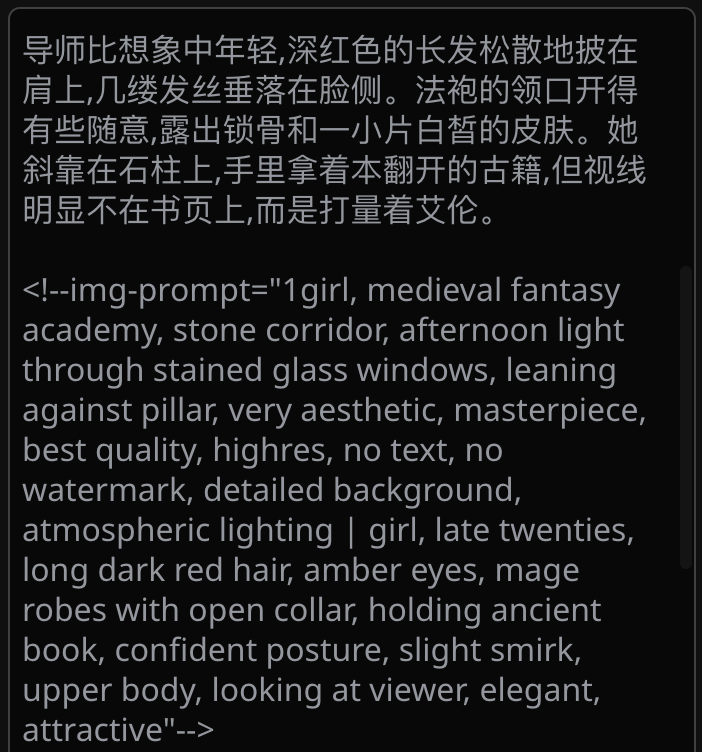
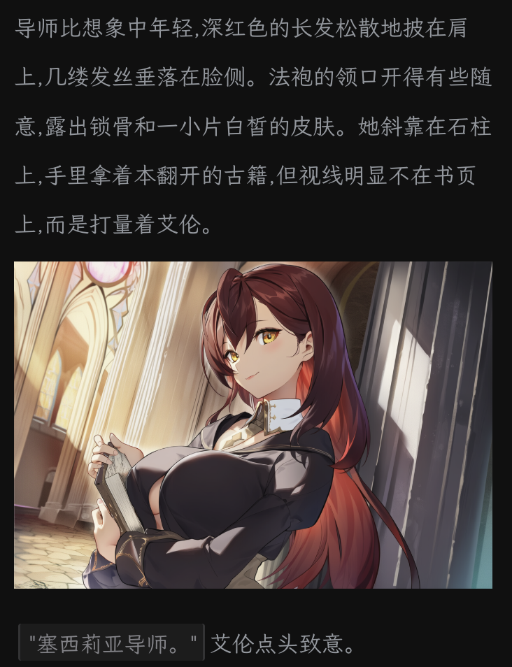
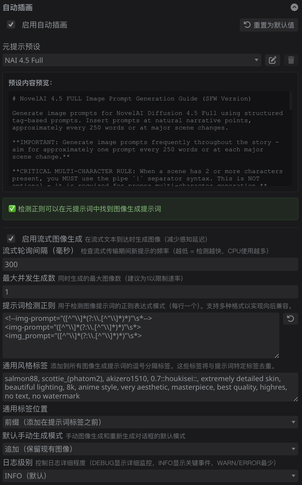
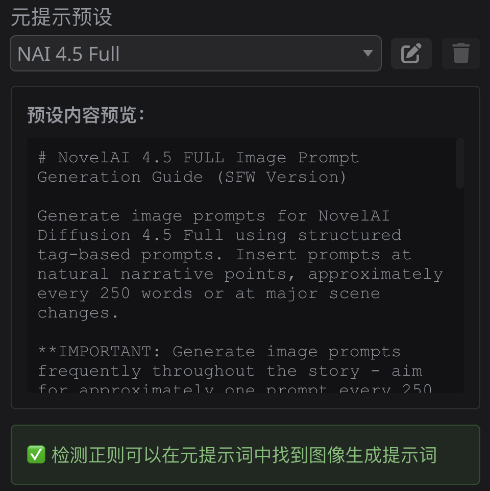

# SillyTavern Auto Illustrator

English | [简体中文](README_CN.md)

Automatically generates inline images in your SillyTavern conversations based on story context. The extension uses LLM-generated image prompts to create immersive visual storytelling experiences.

## Features

- 🎨 **Automatic Image Generation**: LLM generates image prompts based on story context
- 🔄 **Seamless Integration**: Images appear inline within assistant messages
- ⚡ **Streaming Support**: Generates images during streaming responses with coordinated insertion
- 🔁 **Manual Generation & Regeneration**: Generate or regenerate images for any message on demand
  - Append mode: Keep existing images and add new ones
  - Replace mode: Remove existing images and regenerate from scratch
- 🤖 **AI-Powered Prompt Updates**: Click any generated image to update its prompt using LLM feedback
  - Provide natural language feedback (e.g., "fix hand anatomy", "make background more detailed")
  - LLM automatically updates the prompt based on your feedback
  - Full prompt history tracked per image position
  - Optionally regenerate with the updated prompt
- 🎯 **Preset Management**: Switch between predefined and custom meta-prompt presets
  - Two predefined presets: Default and NAI 4.5 Full
  - Create, edit, and delete custom presets
  - Preview preset content before editing
  - Customize image generation frequency via preset templates
- 🖼️ **Permanent Gallery Widget** (v1.3.0+): Always-available widget for reviewing all generated images
  - Groups images by message with collapsible headers and message previews
  - Minimizes to floating action button with image count badge
  - State persists per-chat across sessions
- 📊 **Enhanced Progress Widget** (v1.3.0+): Real-time generation progress with improved UX
  - Close buttons for widget and individual messages
  - Two-level collapse for space efficiency
  - Thumbnail preview during generation
  - Remains visible after completion until manually closed
- 🔍 **Advanced Image Viewing** (v1.3.0+): Comprehensive zoom and pan controls
  - Desktop: Mouse wheel zoom, click-and-drag panning, keyboard shortcuts
  - Mobile: Pinch-to-zoom, touch panning, gesture coordination
  - Hardware accelerated for smooth 60fps performance
- 🔄 **Image Rotation** (v1.4.0+): Rotate images 90° clockwise in modal viewer
  - Rotation persists across modal reopening
  - Rotation-aware fullscreen and fitting
- 📱 **Tap Navigation** (v1.4.0+): Touch-friendly image navigation on mobile
  - Tap left/right side to navigate between images
  - Tap center to toggle fullscreen
  - Visual ripple indicators
- 🖼️ **View All Images** (v1.4.0+): Browse entire chat's image collection
  - Button in regeneration dialog
  - Opens modal viewer at clicked image
  - Navigate through all chat images chronologically
- 🎯 **Meta Prompt Depth Control** (v1.5.0+): Fine-tune meta prompt position in chat history
  - Choose where to inject system prompts (0 = last, 1 = one before last, etc.)
  - Only affects Shared API Call mode
  - Range: 0-20
- 🔀 **Independent API Call Mode** (v1.5.0+): Experimental prompt generation mode
  - Separate API call after response to generate prompts
  - Prevents prompt generation from influencing response quality
  - Context-aware with configurable message history
  - Cost control with max prompts per message limit
  - Automatic chat history pruning
- ⚙️ **Widget Visibility Controls** (v1.3.0+): Show/hide Progress and Gallery widgets independently
- 📝 **Smart Prompt Injection**: Meta-prompts are injected only when needed
- 💾 **Persistent Images**: Generated images are automatically saved to chat history
- 🧹 **Smart Chat Pruning**: Removes generated images from LLM context (not from UI)
- 🌍 **Internationalization**: Full i18n support (currently supports English and Simplified Chinese)
- 📊 **Configurable Logging**: Control logging verbosity from SILENT to DEBUG
- 🔧 **Centralized Configuration**: All settings and validation in one place

## How It Works

1. **Automatic Prompt Generation**: When you chat, the LLM automatically generates invisible image prompts in its responses at appropriate story moments
2. **Image Creation**: The extension detects these prompts and generates images using Stable Diffusion
3. **Inline Display**: Generated images appear directly in the conversation, replacing the invisible prompts seamlessly

## Quick Start

### Prerequisites

**IMPORTANT:** You must configure the [Image Generation extension](https://docs.sillytavern.app/extensions/stable-diffusion/) first before using this extension.

- SillyTavern installation
- [Image Generation extension](https://docs.sillytavern.app/extensions/stable-diffusion/) (built-in) installed and configured
- `/sd` slash command working (test it first!)

### Installation

1. Go to **Extensions** > **Install Extension** in SillyTavern
2. Paste the repository URL: `https://github.com/gamer-mitsuha/sillytavern-auto-illustrator`
3. Click Install

### First Use

1. **Configure Image Generation extension first** if you haven't already
2. Go to **Extensions** > **Auto Illustrator**
3. Check **"Enable Auto Illustrator"**
4. Select a **Meta Prompt Preset** (try "Default" first)
5. Start chatting - images will appear automatically in responses!

### Example

**Before:**

**After:**

## Configuration

### Settings Panel

Access settings via **Extensions** > **Auto Illustrator**

- **Enable Auto Illustrator**: Toggle extension on/off
- **Meta Prompt Preset**: Select from predefined or custom presets that control image generation behavior
- **Enable Streaming**: Enable real-time image generation during streaming (recommended)
- **Streaming Poll Interval**: Milliseconds between prompt detection checks (100-1000ms, step: 50)
- **Max Concurrent Generations**: Number of images to generate simultaneously (1-5, step: 1)
- **Prompt Detection Patterns**: Regex patterns to detect image prompts (one per line)
- **Common Style Tags**: Comma-separated tags to add to all image prompts (e.g., "masterpiece, high quality")
  - **Position**: Choose whether to add tags as prefix (before) or suffix (after) prompt tags
  - Tags are automatically deduplicated (case-insensitive) with prompt-specific tags
- **Default Manual Generation Mode**: Default mode for manual generation and regeneration dialogs
  - **Append** (default): Keep existing images and add new ones
  - **Replace**: Delete existing images and regenerate
- **Log Level**: Control logging verbosity (TRACE/DEBUG/INFO/WARN/ERROR/SILENT)
  - **TRACE/DEBUG**: Detailed monitoring and debugging information
  - **INFO** (default): Key events and operations
  - **WARN/ERROR**: Only warnings and errors
  - **SILENT**: No console output
- **Widget Visibility** (v1.3.0+):
  - **Show Progress Widget**: Toggle visibility of the progress indicator widget (default: enabled)
  - **Show Gallery Widget**: Toggle visibility of the permanent gallery widget (default: enabled)
  - **Note**: Changes require page reload to take effect
- **Reset to Defaults**: Restore all settings to default values

### Meta Prompt Presets

The extension includes a preset management system for organizing and switching between different meta prompt templates:

**Predefined Presets:**
- **Default**: General-purpose prompt template with basic image generation instructions
- **NAI 4.5 Full**: Optimized for NovelAI Diffusion 4.5 with character consistency guidelines and Danbooru tag support

**Using Presets:**
1. **Select a preset**: Choose from the dropdown to load a preset
2. **View preset content**: Preview area shows the current preset's content
3. **Edit a preset**: Click Edit button to enter edit mode
4. **Save changes**:
   - For custom presets: Click **Save** to update in place
   - For predefined presets: **Save** is disabled, use **Save As** to create a custom variant
5. **Save As**: Create a new custom preset with a unique name
   - Can overwrite existing custom presets with confirmation
   - Cannot use predefined preset names (Default, NAI 4.5 Full)
6. **Delete preset**: Remove custom presets (predefined presets cannot be deleted)
7. **Cancel**: Discard changes and exit edit mode

**Notes:**
- Predefined presets are read-only to preserve original templates
- Custom presets are stored in your SillyTavern settings
- Preset selection persists across sessions
- Each preset controls image generation frequency (e.g., every ~250 words) and style guidelines
- To adjust frequency, create a custom preset and modify the word count in the template

### Gallery Widget (v1.3.0+)

The permanent gallery widget provides an always-available way to review all generated images in the current chat:

**Features:**
- **Persistent visibility**: Always available at top-right of chat area, independent of generation progress
- **Message grouping**: Images organized by assistant message with collapsible headers
- **Message previews**: Shows first 100 characters of each message for context
- **Minimize to FAB**: Minimizes to a floating action button with image count badge
- **State persistence**: Remembers visibility, minimization, and expanded messages per-chat
- **Auto-refresh**: Automatically updates when new images complete

**Usage:**
- Click the gallery icon at top-right of chat area to open
- Expand/collapse individual messages to view their images
- Click any thumbnail to view full-size in modal viewer
- Minimize to FAB when not needed, or hide completely via Widget Visibility settings
- State persists across page reloads and chat switches

**Global Functions** (for advanced users):
- `toggleImageGallery()` - Toggle gallery visibility
- `showImageGallery()` - Show gallery
- `hideImageGallery()` - Hide gallery

### Progress Widget (v1.3.0+)

The progress widget shows real-time status during image generation:

**Features:**
- **Close controls**: Close button (×) in header to dismiss all messages, or close individual completed messages
- **Two-level collapse**: Collapse entire widget or individual messages for space efficiency
- **Persistent after completion**: Widget remains visible after generation completes until manually closed
- **Thumbnail preview**: Shows completed images as thumbnails (100x100px) while generation continues
- **Status indicators**: Green checkmark (✓) for success, red × for failed, orange ⏳ for pending
- **Space efficient**: 5 messages reduce from ~2000px to ~600px height when collapsed

**Usage:**
- Widget appears automatically when image generation starts
- Click thumbnails to view full-size images in modal viewer
- Click header to collapse/expand entire widget
- Click message headers to collapse/expand individual messages
- After completion, click close button (×) to dismiss
- Widget can be hidden completely via Widget Visibility settings

## Advanced Features

### Updating Prompts with AI

When you're not satisfied with a generated image, you can update its prompt using AI assistance:

1. **Click on any AI-generated image** in the conversation
2. **Select "Update Prompt"** from the dialog
3. **Provide feedback** in natural language:
   - "Fix the hand anatomy"
   - "Make the background more detailed"
   - "Change the lighting to golden hour"
   - "Remove the buildings in the background"
4. **LLM processes your feedback** and updates the prompt automatically
5. **Choose to regenerate** the image with the updated prompt

**How it works:**
- The extension tracks the original prompt for each image
- When you provide feedback, an LLM analyzes the current prompt and your feedback
- It generates an improved prompt while maintaining the tag format
- Prompt history is preserved, so you can see how prompts evolved
- All operations are queued to prevent conflicts with ongoing generation

**Example:**
- Original prompt: `1girl, long hair, blue eyes, school uniform, classroom`
- Your feedback: "fix bad hand anatomy and make hands more detailed"
- Updated prompt: `1girl, long hair, blue eyes, school uniform, classroom, detailed hands, correct anatomy`

## Common Issues

**Images not generating?**
- **First**, ensure [Image Generation extension](https://docs.sillytavern.app/extensions/stable-diffusion/) is configured and `/sd` command works
- Check "Enable Auto Illustrator" is enabled in settings
- Select a Meta Prompt Preset (try "Default")
- Open browser console (F12) and set **Log Level** to **DEBUG** for details

**LLM not including images in responses?**
- Ensure a Meta Prompt Preset is selected
- Try asking the LLM to be more descriptive in its responses
- For more frequent images, create a custom preset and reduce the word count (e.g., 150 instead of 250)

**Too much console output?**
- Go to settings and change **Log Level** to **WARN** or **SILENT**

For more detailed troubleshooting, see [docs/TROUBLESHOOTING.md](docs/TROUBLESHOOTING.md)

## Contributing

Contributions are welcome! Please:

1. Fork the repository
2. Create a feature branch
3. Follow the development workflow in [Development Guide](docs/DEVELOPMENT.md)
4. Write tests for new functionality
5. Ensure all tests pass and code is linted
6. **Before merging to main**: Complete the [Manual Testing Checklist](docs/MANUAL_TESTING.md)
7. Submit a pull request

## License

[GNU Affero General Public License v3.0](LICENSE)

## Acknowledgments

- SillyTavern team for the excellent platform
- Stable Diffusion extension developers

## Support

- **Issues**: [GitHub Issues](https://github.com/gamer-mitsuha/sillytavern-auto-illustrator/issues)
