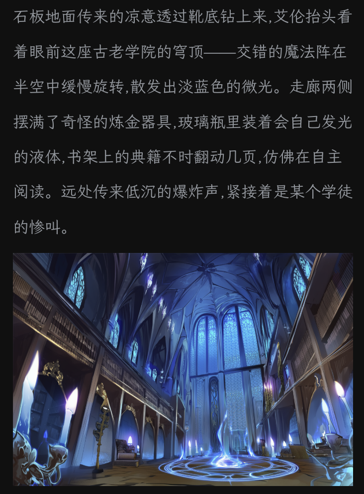
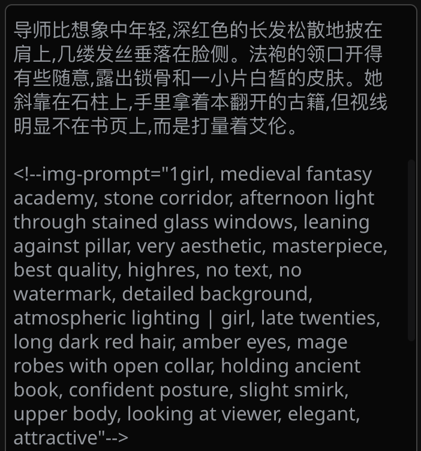

# SillyTavern 自动插画

[English](README.md) | 简体中文

基于故事上下文，在 SillyTavern 对话中自动生成内联图像。本扩展使用 LLM 生成的图像提示词来创建沉浸式的视觉叙事体验。

## 功能特性

- 🎨 **自动图像生成**：LLM 根据故事上下文生成图像提示词
- 🔄 **无缝集成**：图像直接显示在助手消息中
- ⚡ **流式支持**：在流式响应过程中生成图像并协调插入
- 🔁 **手动生成和重新生成**：随时为任何消息按需生成或重新生成图像
  - 追加模式：保留现有图像并添加新图像
  - 替换模式：删除现有图像并从头重新生成
- 🎯 **预设管理**：在预定义和自定义元提示预设之间切换
  - 两个预定义预设：Default 和 NAI 4.5 Full
  - 创建、编辑和删除自定义预设
  - 编辑前预览预设内容
  - 通过预设模板自定义图像生成频率
- 📝 **智能提示注入**：仅在需要时注入元提示
- 💾 **持久化图像**：生成的图像自动保存到聊天历史
- 🧹 **智能聊天修剪**：从 LLM 上下文中移除生成的图像（UI 中仍可见）
- 🌍 **国际化支持**：完整的 i18n 支持（目前支持英文和简体中文）
- 📊 **可配置日志**：从 SILENT 到 DEBUG 控制日志详细程度
- 🔧 **集中配置**：所有设置和验证集中在一处

## 工作原理

1. **自动生成提示**：当您聊天时，LLM 会在适当的故事时刻在其响应中自动生成不可见的图像提示
2. **创建图像**：扩展检测这些提示并使用 Stable Diffusion 生成图像
3. **内联显示**：生成的图像直接出现在对话中，无缝替换不可见的提示

## 快速开始

### 前提条件

**重要提示：** 在使用本扩展之前，您必须先配置[图像生成扩展](https://docs.sillytavern.app/extensions/stable-diffusion/)。

- SillyTavern 安装
- [图像生成扩展](https://docs.sillytavern.app/extensions/stable-diffusion/)（内置）已安装并配置
- `/sd` 斜杠命令可用（请先测试！）

### 安装

1. 前往 SillyTavern 的 **Extensions** > **Install Extension**
2. 粘贴仓库 URL：`https://github.com/gamer-mitsuha/sillytavern-auto-illustrator`
3. 点击安装

### 首次使用

1. **如果尚未配置，请先配置图像生成扩展**
2. 前往 **Extensions** > **Auto Illustrator**
3. 勾选 **"启用自动插画"**
4. 选择一个 **元提示预设**（建议先试用 "Default"）
5. 开始聊天 - 图像将自动出现在响应中！

### 示例

**之前：**

**之后：**

## 配置

### 设置面板

通过 **Extensions** > **Auto Illustrator** 访问设置

- **启用自动插画**：开关扩展的启用/禁用
- **元提示预设**：从预定义或自定义预设中选择，控制图像生成行为
- **启用流式**：启用流式传输期间的实时图像生成（推荐）
- **流式轮询间隔**：提示检测检查之间的毫秒数（100-1000ms，步长：50）
- **最大并发生成数**：同时生成的图像数量（1-5，步长：1）
- **提示检测模式**：用于检测图像提示的正则表达式模式（每行一个）
- **通用风格标签**：添加到所有图像提示的逗号分隔标签（例如："masterpiece, high quality"）
  - **位置**：选择将标签作为前缀（之前）还是后缀（之后）添加到提示词标签
  - 标签会自动与提示词特定标签去重（不区分大小写）
- **默认手动生成模式**：手动生成和重新生成对话框的默认模式
  - **追加**（默认）：保留现有图像并添加新图像
  - **替换**：删除现有图像并重新生成
- **日志级别**：控制日志详细程度（TRACE/DEBUG/INFO/WARN/ERROR/SILENT）
  - **TRACE/DEBUG**：详细的监控和调试信息
  - **INFO**（默认）：关键事件和操作
  - **WARN/ERROR**：仅警告和错误
  - **SILENT**：无控制台输出
- **重置为默认值**：恢复所有设置为默认值

### 元提示预设

扩展包含一个预设管理系统，用于组织和切换不同的元提示模板：

**预定义预设：**
- **Default**：通用提示模板，包含基本的图像生成指令
- **NAI 4.5 Full**：针对 NovelAI Diffusion 4.5 优化，包含角色一致性指南和 Danbooru 标签支持

**使用预设：**
1. **选择预设**：从下拉菜单中选择加载预设
2. **查看预设内容**：预览区域显示当前预设的内容
3. **编辑预设**：点击编辑按钮进入编辑模式
4. **保存更改**：
   - 对于自定义预设：点击**保存**就地更新
   - 对于预定义预设：**保存**被禁用，使用**另存为**创建自定义变体
5. **另存为**：创建具有唯一名称的新自定义预设
   - 可以在确认后覆盖现有的自定义预设
   - 不能使用预定义预设名称（Default、NAI 4.5 Full）
6. **删除预设**：删除自定义预设（预定义预设无法删除）
7. **取消**：放弃更改并退出编辑模式

**注意事项：**
- 预定义预设为只读，以保留原始模板
- 自定义预设存储在您的 SillyTavern 设置中
- 预设选择在会话间保持
- 每个预设控制图像生成频率（例如，每约 250 个词）和风格指南
- 要调整频率，创建自定义预设并修改模板中的词数

## 常见问题

**图像无法生成？**
- **首先**，确保[图像生成扩展](https://docs.sillytavern.app/extensions/stable-diffusion/)已配置且 `/sd` 命令可用
- 检查设置中是否勾选了"启用自动插画"
- 选择一个元提示预设（建议先试用 "Default"）
- 打开浏览器控制台（F12）并将**日志级别**设置为 **DEBUG** 查看详细信息

**LLM 响应中没有图像？**
- 确保已选择元提示预设
- 尝试让 LLM 在响应中更详细地描述场景
- 要获得更频繁的图像，创建自定义预设并减少词数（例如，从 250 改为 150）

**控制台输出过多？**
- 前往设置并将**日志级别**更改为 **WARN** 或 **SILENT**

更多详细的故障排除信息，请参阅 [docs/TROUBLESHOOTING.md](docs/TROUBLESHOOTING.md)

## 贡献

欢迎贡献！请：

1. Fork 仓库
2. 创建功能分支
3. 遵循[开发指南](docs/DEVELOPMENT.md)中提到的开发工作流
4. 为新功能编写测试
5. 确保所有测试通过且代码已 lint
6. 提交 pull request

## 许可证

[GNU Affero General Public License v3.0](LICENSE)

## 致谢

- SillyTavern 团队提供的优秀平台
- Stable Diffusion 扩展开发者

## 支持

- **Issues**：[GitHub Issues](https://github.com/gamer-mitsuha/sillytavern-auto-illustrator/issues)
